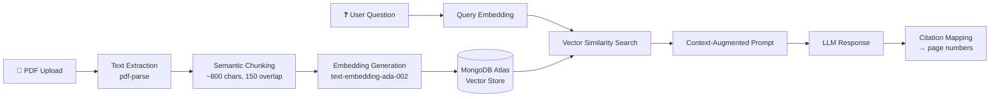
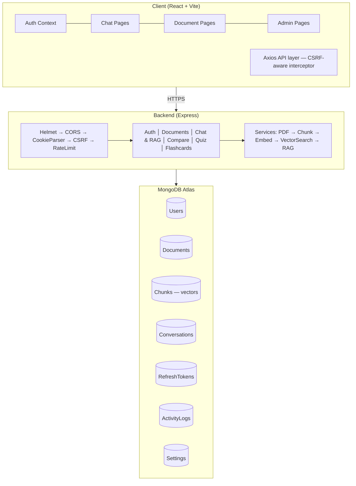

<div align="center">

# 🧠 DocMind AI

### Enterprise-Grade Document Intelligence Platform powered by Retrieval-Augmented Generation

**Upload. Ask. Understand.**
Turn static PDFs into conversational knowledge bases with page-accurate citations — no hallucinations, no guesswork.

[](https://docmind-ai-opal.vercel.app)
[](https://github.com/kanhaiyaray/Docmind-Ai)


</div>

## 📖 Table of Contents

<details open>
<summary>Click to expand</summary>

- [About The Project](#-about-the-project)
- [Why DocMind?](#-why-docmind)
- [RAG Pipeline — The Engine](#-rag-pipeline--the-engine)
- [Feature Highlights](#-feature-highlights)
- [Tech Stack](#️-tech-stack)
- [System Architecture](#️-system-architecture)
- [Database Schema](#-database-schema)
- [Getting Started](#-getting-started)
- [Environment Variables](#-environment-variables)
- [API Reference](#-api-reference)
- [Admin Panel](#-admin-panel)
- [Security](#-security)
- [Performance Notes](#-performance-notes)
- [Deployment](#-deployment)
- [Project Structure](#-project-structure)
- [Roadmap](#️-roadmap)
- [FAQ](#-faq)
- [Contributing](#-contributing)
- [Acknowledgments](#-acknowledgments)
- [License](#-license)

</details>

---

## 🧠 About The Project

**DocMind AI** is a full-stack SaaS platform that turns static documents into an interactive knowledge base. Instead of manually skimming through PDFs, you upload a document and converse with it — DocMind retrieves the exact passages relevant to a question, grounds the LLM's answer in that retrieved context, and returns a response with **page-level citations** so every claim can be traced back to its source.

This isn't a thin wrapper around a chat API — it's a complete **Retrieval-Augmented Generation (RAG)** pipeline built from the ground up:

```
PDF Upload → Text Extraction → Semantic Chunking → Embedding Generation
    → Vector Similarity Search → Context-Augmented Prompt → LLM Response
```

Built as a production-style application with authentication, refresh-token rotation, device-level session management, an admin dashboard, rate limiting, CSRF protection, and audit logging — the same concerns a real SaaS product has to solve.

> 💡 **Why it matters:** most "AI chat with your PDF" demos skip the boring-but-critical parts — session security, multi-tenant data isolation, rate limiting, auditability. DocMind treats those as first-class requirements, not afterthoughts.

---

## 💡 Why DocMind?

| Problem | DocMind's Solution |
|---|---|
| Reading long PDFs to find one answer wastes time | Ask a natural-language question, get a grounded answer in seconds |
| LLMs hallucinate when they don't have real context | Every answer is retrieved from the actual document — not the model's memory |
| "Where did that answer come from?" | Page-level citations link every response back to its source |
| Comparing multiple documents manually is tedious | Built-in document comparison surfaces themes, similarities, and differences |
| Studying long documents for retention | AI-generated quizzes and spaced-repetition flashcards from the content itself |
| Multi-device account access is opaque | Per-device session listing with remote revocation |

---

## 🔬 RAG Pipeline — The Engine

The core of DocMind is its retrieval pipeline. Here's what happens under the hood every time a document is uploaded and queried:



| Step | What happens |
|---|---|
| **1. Ingestion** | `pdf-parse` extracts raw text page-by-page while preserving page boundaries — this is what later makes page-level citations possible. Image-based/scanned PDFs are detected early and rejected with a clear error. |
| **2. Chunking** | Text is split into ~800-character semantic chunks with a 150-character overlap, snapping to sentence boundaries where possible so context isn't lost at chunk edges. Each chunk retains its source page number. |
| **3. Embedding** | Every chunk is vectorized via OpenAI's `text-embedding-ada-002` model and stored alongside the chunk in MongoDB. |
| **4. Retrieval** | When a user asks a question, the query is embedded and a vector similarity search finds the most semantically relevant chunks. If Atlas Vector Search is unavailable, the system transparently falls back to keyword-based text search. |
| **5. Augmentation & Generation** | Retrieved chunks are injected into the prompt as grounding context before being sent to the LLM, which is instructed to answer only from the supplied context and to cite the page(s) it drew from. |
| **6. Citation Mapping** | The response is post-processed to map cited claims back to their originating page numbers and document, which the frontend renders as clickable source references. |

---

## ✨ Feature Highlights

<table>
<tr>
<td valign="top" width="50%">

### 🔐 Authentication & Security
- JWT auth with HTTP-only cookies
- 15-min access token + 7-day rotating refresh token
- CSRF protection (double-submit cookie)
- Email verification & password reset (Resend)
- Per-device session management with remote revoke
- IP-based rate limiting on sensitive endpoints
- Password strength policy + common-password blacklist

</td>
<td valign="top" width="50%">

### 📄 Document Management
- Drag-and-drop PDF upload (10 MB cap)
- Automatic background processing
- Live status tracking (processing → completed → failed)
- Intelligent overlap-based semantic chunking
- Full-text search across your library
- Pagination + infinite scroll

</td>
</tr>
<tr>
<td valign="top" width="50%">

### 💬 AI-Powered Chat (RAG)
- Single-document and multi-document chat
- Page-level source citations on every answer
- AI-suggested starter questions
- Persistent, searchable conversation history
- Streaming-ready architecture

</td>
<td valign="top" width="50%">

### 🧩 Smart Tools
- **Document Comparison** — themes, similarities, differences, complementary info
- **Quiz Generator** — MCQ / True-False / Fill-in-the-blank, with difficulty control
- **Flashcards** — 3D flip cards with keyboard navigation
- **AI Summarization** — executive summaries on demand

</td>
</tr>
<tr>
<td valign="top" colspan="2">

### 📊 Admin Dashboard
Full user CRUD with bulk actions · Cross-user document oversight · Activity audit logs · Live analytics (registrations, uploads, active users, per-user doc counts) · System-wide configuration panel

</td>
</tr>
</table>

---

## 🛠️ Tech Stack

<table>
<tr>
<td valign="top" width="50%">

**Frontend**

| Tech | Version | Role |
|---|---|---|
| React | 18.3.1 | UI framework |
| Vite | 8.2.2 | Build tool / dev server |
| TailwindCSS | 3.4.19 | Utility-first styling |
| React Router DOM | 7.18.3 | Client-side routing |
| Axios | 1.20.0 | HTTP client + CSRF interceptor |
| React Markdown | 9.1.0 | Rendering AI responses |
| Lucide React | 0.294.0 | Icon system |
| React Hot Toast | 2.6.0 | Notifications |

</td>
<td valign="top" width="50%">

**Backend**

| Tech | Version | Role |
|---|---|---|
| Node.js | 22.x | Runtime |
| Express | 4.18.2 | Web framework |
| MongoDB (Atlas) | 6.x | Database + vector store |
| Mongoose | 6.8.0 | ODM |
| JWT | 9.0.0 | Auth tokens |
| Multer | 2.3.0 | File uploads |
| pdf-parse | 2.4.5 | PDF text extraction |
| OpenAI SDK | 7.10.0 | Embeddings + chat |
| Resend | 6.26.0 | Transactional email |
| Helmet | 7.2.0 | Security headers |
| csurf | 1.11.0 | CSRF protection |
| express-rate-limit | 8.7.0 | Rate limiting |

</td>
</tr>
</table>

---

## 🏗️ System Architecture



---

## 💾 Database Schema

<details>
<summary><strong>User</strong></summary>

```js
{
  name: String,
  email: String (unique, lowercase),
  password: String (bcrypt, salt=12, select:false),
  role: ['user', 'admin'],
  isActive: Boolean,
  isEmailVerified: Boolean,
  emailVerificationToken: String,
  resetPasswordToken: String,
  lastLogin: Date,
  failedLoginAttempts: Number,
  accountLockedUntil: Date,
  settings: { theme, notifications },
  createdAt: Date,
  updatedAt: Date
}
```
</details>

<details>
<summary><strong>Document</strong></summary>

```js
{
  userId: ObjectId (ref: User, indexed),
  title: String,
  filename: String,
  fileUrl: String,
  fileSize: Number,
  pageCount: Number,
  status: ['processing', 'completed', 'failed'],
  processingError: String,
  metadata: { author, title, subject, keywords, creationDate, modificationDate },
  summary: String,
  tags: [String],
  isFavorite: Boolean,
  createdAt: Date,
  updatedAt: Date
}
// Indexes: { userId, createdAt }, { userId, status }, { title: 'text' }
```
</details>

<details>
<summary><strong>Chunk</strong> — the vector store</summary>

```js
{
  documentId: ObjectId (ref: Document, indexed),
  userId: ObjectId (ref: User, indexed),
  content: String,
  pageNumber: Number,
  chunkIndex: Number,
  embedding: [Number],   // vector embedding
  metadata: { filename, pageNumber, chunkSize },
  charCount: Number,
  wordCount: Number,
  createdAt: Date,
  updatedAt: Date
}
```
</details>

<details>
<summary><strong>Conversation</strong></summary>

```js
{
  userId: ObjectId (ref: User, indexed),
  documentId: ObjectId (ref: Document, indexed),
  title: String,
  messages: [{
    role: ['user', 'assistant'],
    content: String,
    sources: [{ page, document, documentId }],
    timestamp: Date
  }],
  metadata: { totalTokens, processingTime },
  createdAt: Date,
  updatedAt: Date
}
```
</details>

<details>
<summary><strong>RefreshToken</strong></summary>

```js
{
  userId: ObjectId (ref: User, indexed),
  token: String (unique),
  expiresAt: Date,        // TTL index for auto-cleanup
  isRevoked: Boolean,
  deviceInfo: { userAgent, ipAddress },
  createdAt: Date
}
```
</details>

<details>
<summary><strong>ActivityLog</strong> & <strong>Settings</strong></summary>

```js
// ActivityLog
{
  userId: ObjectId (ref: User),
  action: String,
  details: Mixed,
  ip: String,
  userAgent: String,
  timestamp: Date
}

// Settings
{
  key: String (unique),
  value: Mixed,
  description: String,
  updatedBy: ObjectId (ref: User),
  updatedAt: Date
}
```
</details>

---

## 🚀 Getting Started

### Prerequisites

- Node.js 20.x or higher
- npm 9.x or higher
- MongoDB Atlas account (with Vector Search enabled, or local fallback)
- OpenAI API key (embeddings + chat)
- Resend API key (transactional email)

### 1. Clone the repository

```bash
git clone https://github.com/kanhaiyaray/Docmind-Ai.git
cd Docmind-Ai
```

### 2. Backend setup

```bash
cd docmind-server
npm install
cp .env.example .env
# edit .env — see Environment Variables below
npm run dev
```

The API will start on `http://localhost:5000`.

### 3. Frontend setup

```bash
cd ../docmind-client
npm install
cp .env.example .env.local
# point VITE_API_URL at your backend
npm run dev
```

The app will open on `http://localhost:5173`.

### 4. First-time admin access

1. Register a regular account through the UI
2. Verify your email
3. In MongoDB, set `role: "admin"` on your user document
4. Log back in and open `/admin`

### Quick start with Docker Compose

```bash
docker compose up --build
```

> Add a `docker-compose.yml` at the repo root wiring `docmind-server`, `docmind-client`, and a local MongoDB instance for one-command local spin-up.

---

## 📝 Environment Variables

<details>
<summary><strong>Backend (<code>docmind-server/.env</code>)</strong></summary>

```env
# Server
PORT=5000
NODE_ENV=development

# Database
MONGO_URI=mongodb+srv://<user>:<pass>@cluster.mongodb.net/docmind

# JWT
JWT_SECRET=your_super_secret_jwt_key
JWT_REFRESH_SECRET=your_refresh_secret_key

# Email (Resend)
RESEND_API_KEY=re_xxxxxxxxxxxxxxxxxxxx
EMAIL_FROM=noreply@yourdomain.com
CLIENT_URL=http://localhost:5173

# OpenAI
OPENAI_API_KEY=sk-xxxxxxxxxxxxxxxxxxxx
OPENAI_CHAT_MODEL=gpt-5.6-luna
OPENAI_EMBEDDING_MODEL=text-embedding-ada-002

# CORS (comma-separated)
CORS_ORIGINS=http://localhost:5173

# Upload
UPLOAD_DIR=./uploads
MAX_FILE_SIZE=10485760    # 10 MB

# Chunking
CHUNK_SIZE=800
OVERLAP=150

# Rate limiting
RATE_LIMIT_WINDOW=15      # minutes
RATE_LIMIT_MAX=100        # requests per window

# Logging
LOG_LEVEL=debug
```
</details>

<details>
<summary><strong>Frontend (<code>docmind-client/.env.local</code>)</strong></summary>

```env
VITE_API_URL=http://localhost:5000/api

VITE_APP_NAME=DocMind
VITE_APP_DESCRIPTION=AI Document Intelligence Platform

VITE_ENABLE_DOCUMENT_COMPARISON=true
VITE_ENABLE_QUIZ_GENERATOR=true
VITE_ENABLE_FLASHCARDS=true
VITE_ENABLE_STREAMING_RESPONSES=true
VITE_ENABLE_DARK_MODE=true

VITE_MAX_FILE_SIZE_MB=10
VITE_ALLOWED_FILE_TYPES=.pdf

VITE_DEFAULT_THEME=light
VITE_ENABLE_ANIMATIONS=true
VITE_DEBUG_MODE=true
```
</details>

> ⚠️ **Never commit `.env` files.** Only `.env.example` should be tracked in version control.

---

## 📡 API Reference

All endpoints are prefixed with `/api`. Auth is via HTTP-only cookies; mutating requests require a CSRF token from `GET /api/csrf-token`.

<details>
<summary><strong>🔐 Authentication</strong></summary>

| Method | Endpoint | Description |
|---|---|---|
| POST | `/auth/register` | Create new account (rate-limited, 5/hr) |
| POST | `/auth/login` | Authenticate (rate-limited, 5/15 min) |
| GET | `/auth/verify-email` | Verify email via token query param |
| POST | `/auth/forgot-password` | Request password reset |
| POST | `/auth/reset-password` | Reset with token |
| POST | `/auth/refresh` | Rotate refresh token |
| POST | `/auth/logout` | Logout current session |
| POST | `/auth/logout-all` | Logout every session |
| GET | `/auth/me` | Get current user |
| PUT | `/auth/profile` | Update name/settings |
| PUT | `/auth/password` | Change password |
| GET | `/auth/sessions` | List active sessions |
| DELETE | `/auth/sessions/:id` | Revoke a specific session |
| POST | `/auth/sessions/revoke-others` | Logout other devices |

</details>

<details>
<summary><strong>📄 Documents</strong></summary>

| Method | Endpoint | Description |
|---|---|---|
| POST | `/documents/upload` | Upload PDF (multipart/form-data, field: `document`) |
| GET | `/documents` | List user docs (`?status=&search=&page=&limit=`) |
| GET | `/documents/:id` | Document detail |
| PUT | `/documents/:id` | Update title / tags / favorite |
| DELETE | `/documents/:id` | Delete doc + chunks |
| GET | `/documents/:id/file` | Download file |
| POST | `/documents/summary` | Generate AI summary |
| POST | `/documents/suggest-questions` | Get AI-suggested questions |

</details>

<details>
<summary><strong>💬 Chat (RAG)</strong></summary>

| Method | Endpoint | Description |
|---|---|---|
| POST | `/chat` | Single-doc query `{ question, documentId }` |
| POST | `/chat/multi` | Multi-doc query `{ question, documentIds[] }` |
| GET | `/chat/history` | List conversations |
| GET | `/chat/:id` | Get full conversation |
| DELETE | `/chat/:id` | Delete a conversation |
| DELETE | `/chat/clear/:documentId` | Clear history for a doc |

</details>

<details>
<summary><strong>🧩 AI Tools</strong></summary>

| Method | Endpoint | Description |
|---|---|---|
| POST | `/compare` | Compare 2–3 documents |
| POST | `/quiz/generate` | Generate quiz from a document |
| POST | `/flashcards/generate` | Generate flashcards from a document |

</details>

<details>
<summary><strong>🛡️ Admin</strong> (requires <code>role: admin</code>)</summary>

| Method | Endpoint | Description |
|---|---|---|
| GET | `/admin/stats` | System-wide counters |
| GET | `/admin/analytics` | Registrations & uploads over 30 days |
| GET | `/admin/users` | Paginated user list |
| POST | `/admin/users` | Create user |
| PUT | `/admin/users/:id` | Update user |
| DELETE | `/admin/users/:id` | Delete user + cascade |
| DELETE | `/admin/users` | Bulk delete users |
| GET | `/admin/documents` | All documents |
| DELETE | `/admin/documents/:id` | Delete any document |
| GET | `/admin/logs` | Activity audit log |
| GET | `/admin/settings` | System settings |
| PUT | `/admin/settings/:key` | Upsert setting |
| GET | `/admin/export/users` | CSV export |

</details>

---

## 🔧 Admin Panel

**Access:** Register → flip `role: "admin"` in MongoDB → log back in → visit `/admin`.

**Capabilities:**

- 📊 **Dashboard** — Users, docs, conversations, active-today, avg docs/user, quiz & flashcard generation counts, 30-day registration and upload charts
- 👥 **Users** — View, create, edit, delete; bulk select and delete
- 📄 **Documents** — Cross-user visibility, filter by user/status, bulk delete
- 📋 **Logs** — Full activity audit trail with filters (user, action, date range)
- ⚙️ **Settings** — Live key/value system configuration

Every admin route requires JWT auth + a valid CSRF token + admin-role verification, and every admin action is written to the activity log with IP + user agent.

---

## 🔒 Security

| Layer | Implementation |
|---|---|
| Password hashing | bcryptjs, salt rounds = 12 |
| Access tokens | JWT, HTTP-only cookies, 15-min expiry |
| Refresh tokens | 7-day expiry, rotated on every use |
| Token storage | Server-side `RefreshToken` collection with TTL index |
| CSRF | csurf double-submit cookie pattern |
| Rate limiting | IP-based, per-route (5 login attempts / 15 min) |
| Security headers | helmet |
| CORS | Strict origin allow-list, `credentials: true` |
| Input validation | express-validator on auth routes |
| Injection protection | Mongoose ODM parameterization |
| File uploads | MIME-type whitelist (PDF only), size cap |
| Session revocation | Per-device revoke + revoke-all-others |
| Audit trail | Activity logs capture IP + user agent on sensitive actions |

**Password policy:** min 8 chars, one uppercase, one lowercase, one digit, one special character, and a common-password blacklist.

**Session security:** Refresh-token rotation on every use, per-device session listing with remote revocation, and automatic cleanup of expired tokens via MongoDB TTL index.

> Found a vulnerability? Please disclose responsibly by opening a private security advisory on GitHub rather than a public issue.

---

## ⚡ Performance Notes

- Vector search falls back gracefully to keyword-based text search when Atlas Vector Search indexes aren't available — no hard dependency on a specific Atlas tier during local development.
- Chunking is tuned for a balance between retrieval precision (smaller chunks) and context coherence (larger chunks) — 800 characters with 150-character overlap sits in a well-tested middle ground for prose-heavy PDFs.
- Consider adding response caching for repeated questions on the same document, and batching embedding calls for large multi-page uploads to reduce OpenAI round-trips.

---

## 🚢 Deployment

### Backend — Render / Railway / Fly.io

```yaml
Build Command: npm install
Start Command: node server.js
Port:          10000 (or $PORT)
```

### Frontend — Vercel / Netlify

```bash
npm i -g vercel
vercel
```

`docmind-client/vercel.json`:

```json
{
  "rewrites": [{ "source": "/(.*)", "destination": "/" }]
}
```

### Docker

```bash
cd docmind-server
docker build -t docmind-server .
docker run -p 10000:10000 --env-file .env docmind-server
```

### Environments

| Environment | Backend | Frontend |
|---|---|---|
| Development | `http://localhost:5000` | `http://localhost:5173` |
| Production | `https://api.yourdomain.com` | `https://docmind-ai-opal.vercel.app` |

---

## 📁 Project Structure

```
DocMind-Ai/
├── docmind-client/                     # React frontend
│   ├── src/
│   │   ├── components/                 # DocumentUpload, Sidebar, Topbar, AdminRoute,
│   │   │                               # PrivateRoute, ErrorBoundary, Loading, ...
│   │   ├── pages/                      # Login, Register, Dashboard, Documents, Chat,
│   │   │                               # Compare, Quiz, Flashcards, Settings, History,
│   │   │                               # Sessions, VerifyEmail, ForgotPassword,
│   │   │                               # ResetPassword, Admin/*
│   │   ├── context/                    # AuthContext, ThemeContext
│   │   ├── hooks/                      # useDebounce, useErrorHandler, useLocalStorage
│   │   ├── services/api.js             # Axios + CSRF interceptor
│   │   ├── App.jsx / main.jsx / index.css
│   ├── vite.config.js
│   ├── tailwind.config.js
│   └── vercel.json
│
├── docmind-server/                     # Node.js backend
│   ├── config/db.js                    # Mongoose connection
│   ├── controllers/                    # auth, chat, document, compare, quiz,
│   │                                   # flashcard, extra
│   ├── middleware/                     # authMiddleware, authRateLimiter,
│   │                                   # uploadMiddleware, errorMiddleware
│   ├── models/                         # User, Document, Chunk, Conversation,
│   │                                   # RefreshToken, ActivityLog, Settings
│   ├── routes/                         # auth, chat, document, compare, quiz, flashcard
│   ├── services/
│   │   ├── pdfService.js               # PDF extraction (rejects image PDFs)
│   │   ├── chunkService.js             # Semantic chunking
│   │   ├── embeddingService.js         # Batch embedding pipeline
│   │   ├── embeddingClient.js          # OpenAI embeddings client
│   │   ├── vectorSearchService.js      # Atlas Vector Search + text fallback
│   │   ├── ragService.js               # RAG orchestration
│   │   ├── aiService.js                # AI facade
│   │   ├── openaiService.js            # OpenAI chat client
│   │   └── emailService.js             # Resend transactional email
│   ├── admin.js                        # Admin router + middleware
│   ├── server.js                       # Express app entry
│   └── Dockerfile
│
└── README.md
```

---

## 🗺️ Roadmap

- [ ] Streaming token-by-token chat responses (SSE)
- [ ] Support for DOCX / TXT / Markdown uploads (beyond PDF)
- [ ] OCR fallback for scanned PDFs
- [ ] Team / workspace collaboration on shared documents
- [ ] Usage-based billing and subscription tiers
- [ ] Self-hosted / open-source LLM option (Ollama, vLLM)
- [ ] Inline document viewer with highlighted citations
- [ ] Multi-language document support

See the [open issues](https://github.com/kanhaiyaray/Docmind-Ai/issues) for the full list.

---

## ❓ FAQ

<details>
<summary><strong>Does DocMind work with scanned (image-only) PDFs?</strong></summary>
Not yet — image-based PDFs are detected during ingestion and rejected with a clear error. OCR fallback is on the roadmap.
</details>

<details>
<summary><strong>What happens if Atlas Vector Search isn't available?</strong></summary>
The retrieval layer transparently falls back to keyword-based text search, so the app keeps working on a standard MongoDB Atlas tier or in local development.
</details>

<details>
<summary><strong>Can I chat across multiple documents at once?</strong></summary>
Yes — the multi-document chat endpoint (<code>/chat/multi</code>) retrieves and blends relevant chunks across every document you select.
</details>

<details>
<summary><strong>How is my data isolated from other users?</strong></summary>
Every document, chunk, and conversation is scoped to a <code>userId</code> at the database level, and all queries are filtered accordingly — cross-user access is only possible through the admin role.
</details>

---

## 🤝 Contributing

Contributions make the open-source community a great place to learn and build. Any contribution is greatly appreciated.

1. Fork the repository
2. Create your feature branch — `git checkout -b feature/amazing-feature`
3. Commit your changes — `git commit -m 'Add amazing feature'`
4. Push to the branch — `git push origin feature/amazing-feature`
5. Open a Pull Request

**Guidelines:**
- Follow Express.js best practices on the backend
- Use functional components and hooks on the frontend
- Keep the API RESTful with consistent response shapes
- Add tests for new features
- Update this README for any API changes

---

## 🙏 Acknowledgments

- [OpenAI](https://openai.com) — GPT models and embeddings
- [MongoDB Atlas](https://www.mongodb.com/atlas) — Database and vector storage
- [Resend](https://resend.com) — Transactional email delivery
- [TailwindCSS](https://tailwindcss.com) — Utility-first styling
- [Lucide](https://lucide.dev) — Icon set
- [Vite](https://vitejs.dev) — Next-generation frontend tooling

---

## 📄 License

Distributed under the MIT License. See [LICENSE](./LICENSE) for details.

<div align="center">

⭐ **If DocMind helped you, consider giving it a star!**

Built with ❤️ by **[Kanhaiya Ray](https://github.com/kanhaiyaray)**

[⬆ Back to Top](#-docmind-ai)

</div>